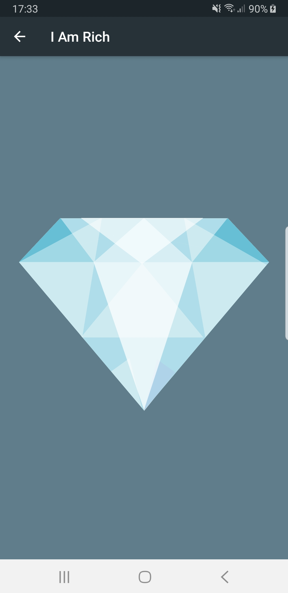
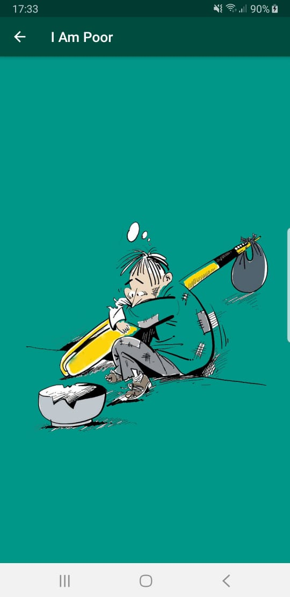
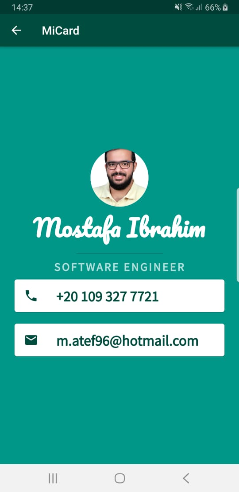
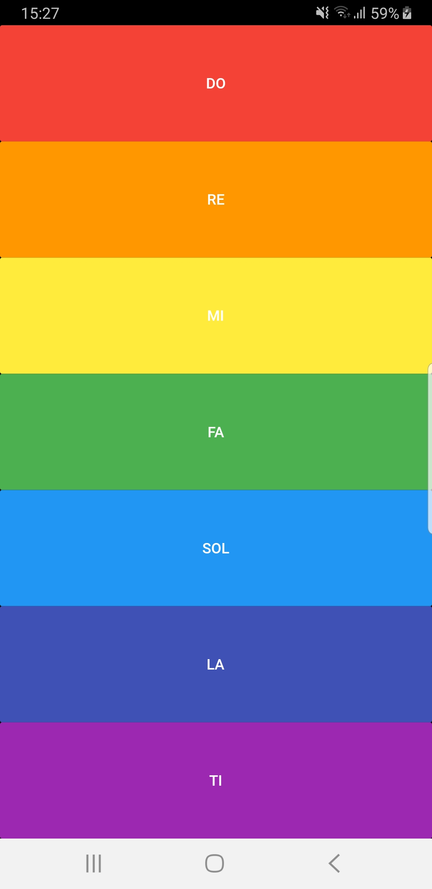

# the Complete App By App Brewery

During the journey of learning Mobile Application development using Flutter in the course by London App Brewery I have come across many interesting apps each was meant to introduce a new concept of Flutter programming.

In this repository, I am going to use Flutter to create a mobile application that contains all exercises and challenges demonstrated in The Complete 2020 Flutter Development Bootcamp with Dart by App Brewery.

## I Am Rich

### What is I Am Rich?

**I Am Rich App** is a very simple application but full of new basic concepts anyone needs to start programming with Flutter. 

### Objectives

In this App, you will learn:
* How to create a new Flutter App.
* How to Scaffold a Flutter App.
* How to deal with pubspec.yaml configuration file.
* How to work with Assets.
* How to Add an App Icon to Flutter Apps.

## I Am Poor

### What is I Am Poor?

**I Am Poor App** is similar to the I Am Rich App. The main idea is to practice creating a new Flutter App from Scratch, and following a given Widget Tree to create the desired UI.

### Notes
*Image was downloaded from pngwing.com*

## MiCard

### What is Mi Card?

**Mi Card** is a personal business card. Imagine every time you wanted to give someone your contact details or your business card but you didn't have it on you. Well, now you can get them to download your business card as an app.

### Objectives

In this App, you will learn:
* How to create Stateless widgets.
* About Hot Reload and Hot Restart.
* How to work with Container, Row, Column, Card and ListTile Widgets.
* How to tap into Widget Properties.
* How to add custom fonts to an app.
* About Material Icons and how to add them to an app.

### Notes
* App Icon was downloaded from pngtree.com
* I have added an app bar to the scaffold to have the same layout as I Am Rich app.

## Dicee

### What is Dicee?

**Dicee** is a Las Vegas dice app. You can make the die roll at the press of a button. With this app in your pocket, you’ll be able to settle any score on the go!

### Objectives

In this App, you will learn:
* How to use Flutter stateless widgets to design the user interface.
* How to use Flutter stateful widgets to update the user interface.
* How to change the properties of various widgets.
* How to use onClick listeners to detect when buttons are pressed.
* How to use setState to mark the widget tree as dirty and requiring update on the next render.
* How to use expanded to make widgets adapt to screen dimensions.
* about string interpolation and how to use it.
* about basic dart programming concepts such as data types and functions.
* How to code and use gesture controls.

### Notes
* App Icon was downloaded from pngtree.com
* Demo Gif was downloaded from the course resources.

## Magic 8 Ball

### What is Magic 8 Ball?

**Magic 8 Ball** is a magical 8 ball app, it will give you the answers to all the tricky questions in life. You can make the ball change at the press of a button.

the process of building this app will solidify what you've learnt in the Dicee tutorial. This app will guide you through the steps required to build an 8 ball app and you will be applying what you have learnt about Stateless and Stateful Flutter widgets.

We’re going to make 

### Notes
* App Icon was downloaded from pngtree.com
* Demo Gif was downloaded from the course resources.

## Xylophone

### What is Xylophone?

In **Xylophone** module we will be diving into more Dart programming concepts and learning how to use open source Flutter packages. By the end of this module, you should be comfortable using Flutter packages and building repeated widgets.

We’re going to make a music app that plays Xylophone sounds. For every Beethoven out there, this will let you unleash your musical talent where ever you are.

### Objectives

In this App, you will learn:
* How to incorporate open source libraries of code into a project using Flutter Packages.
* How to play sound on both iOS and Android.
* How to generate repeated user interface Widgets.
* How to use Dart functions that can take input arguments as well as return an output.
* Dart arrow syntax for writing one line functions.

### Notes
* Image was downloaded from pngtree.com
* I have added a text child to buttons in the home screen representing the Music Scale.

## Quizzler

### What is Quizzler?

**Quizzler** is quiz app that tests your general knowledge. As one of the most popular types of apps on the app stores, you can create your own quiz for other people to enjoy!

This module target is reviewing Stateful and Stateless Widgets as well as learning about the fundamental building blocks of Object Oriented Programming (OOP) - Classes and Objects.

### Objectives

In this App, you will learn:
* Modularising your code into separate classes.
* Dart classes and objects.
* Using class constructors.
* The four pillars of OOP
* Extracting Widgets to refactor your code.
* Private and public modifiers in Dart.
* How to use Dart lists.
* The difference between var, const and final.

### Notes
* App Icon was downloaded from pngtree.com
* Demo Gif was downloaded from the course resources.

## Destini

### What is Destini?

**Destini** is a choose your own adventure game like Bandersnatch. In the process of building this app, you should apply your knowledge from the last module (Quizzler) to use Dart OOP principles to build a well organised project.

### Notes
* App Icon was downloaded from pngtree.com
* Demo Gif was downloaded from the course resources.

## BMI Calculator

### What is BMI Calculator?

**BMI Calculator** is a Body Mass Index Calculator inspired by the beautiful designs made by [Ruben Vaalt](https://dribbble.com/shots/4585382-Simple-BMI-Calculator). It will be a multi screen app with simple functionality but full-on custom styling.

The objective of this tutorial is to look at how we can customise Flutter Widgets to achieve our own beautiful user interface designs. If you have a designer on board, no matter how unconventional their designs are, we can create them using Flutter.

### Objectives
In this App, you will learn:
* How to use Flutter themes to create coherent branding.
* How to create multi-page apps using Flutter Routes and Navigator.
* How to extract and refactor Flutter Widgets with a click of the button.
* How to pass functions as parameters and fields.
* How to use the GestureDetector Widget to detect more than just a tap.
* How to use custom colour palettes by using hex codes.
* How to customise Flutter Widgets to achieve a specific design style.
* Understand Dart Enums and the Ternary Operator.
* Learn about composition vs. inheritance and the Flutter way of creating custom UI.
* Understand the difference between const and final in Dart and when to use each.

### Notes
* App Icon was downloaded from pngtree.com
* Demo Gif was downloaded from the course resources.

## Packages
* [RFlutter Alert](https://pub.dev/packages/rflutter_alert) v1.1.0
* [Audio Players](https://pub.dev/packages/audioplayers) v0.16.2
* [Font Awesome Flutter](https://pub.dev/packages/font_awesome_flutter) v8.10.0
* [Geolocator](https://pub.dev/packages/geolocator) v6.1.2
* [HTTP](https://pub.dev/packages/http) v0.12.2
* [Flutter Spinkit](https://pub.dev/packages/flutter_spinkit) v4.1.2
