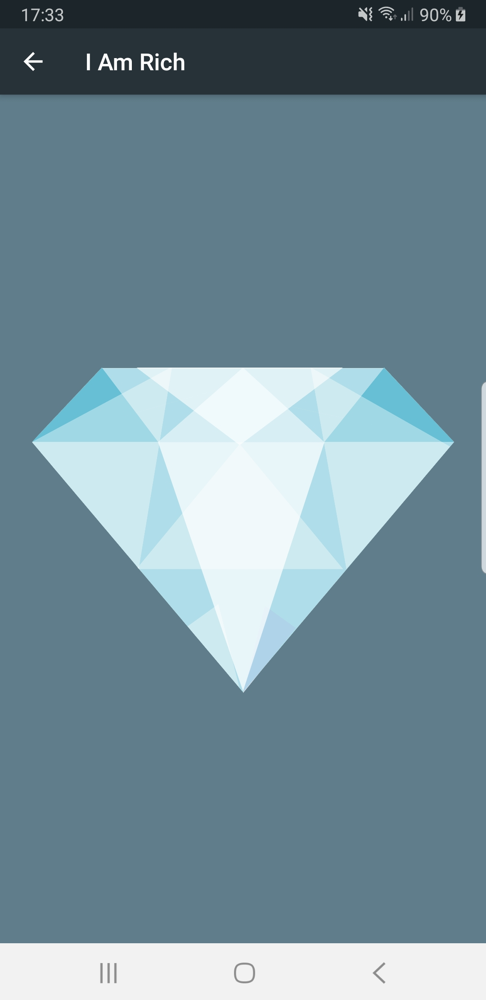
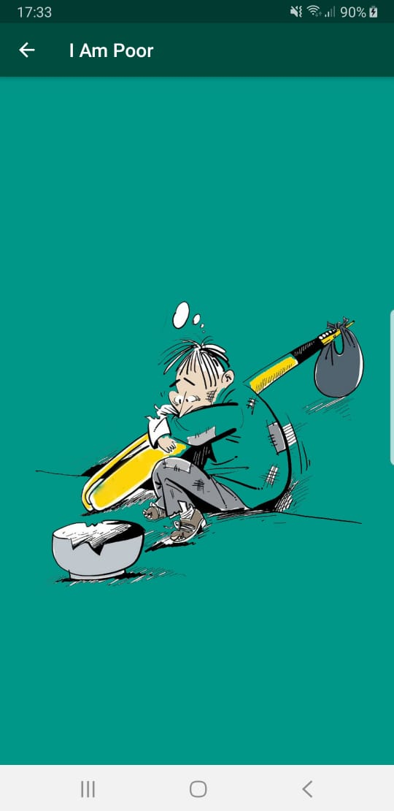
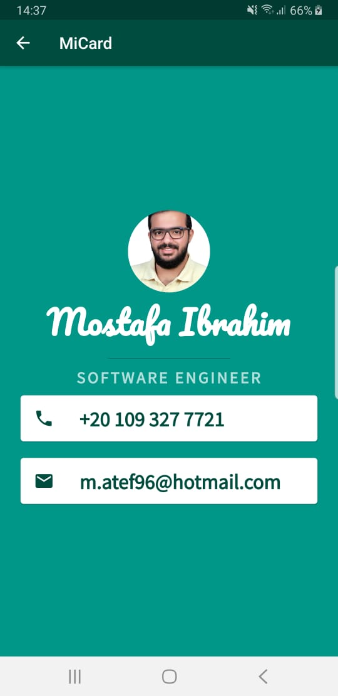

# the Complete App By App Brewery

During the journey of learning Mobile Application development using Flutter in the course by London App Brewery I have come across many interesting apps each was meant to introduce a new concept of Flutter programming.

In this repository, I am going to use Flutter to create a mobile application that contains all exercises and challenges demonstrated in The Complete 2020 Flutter Development Bootcamp with Dart by App Brewery.

## I Am Rich

### What is I Am Rich?

**I Am Rich App** is a very simple application but full of new basic concepts anyone needs to start programming with Flutter. 

### Objectives

In this App, you will learn:
* How to create a new Flutter App.
* How to Scaffold a Flutter App.
* How to deal with pubspec.yaml configuration file.
* How to work with Assets.
* How to Add an App Icon to Flutter Apps.

## I Am Poor

### What is I Am Poor?

**I Am Poor App** is similar to the I Am Rich App. The main idea is to practice creating a new Flutter App from Scratch, and following a given Widget Tree to create the desired UI.

### Notes
*Image was downloaded from pngwing.com*

## MiCard

### What is Mi Card?

**Mi Card** is a personal business card. Imagine every time you wanted to give someone your contact details or your business card but you didn't have it on you. Well, now you can get them to download your business card as an app.

### Objectives

In this App, you will learn:
* How to create Stateless widgets.
* About Hot Reload and Hot Restart.
* How to work with Container, Row, Column, Card and ListTile Widgets.
* How to tap into Widget Properties.
* How to add custom fonts to an app.
* About Material Icons and how to add them to an app.

### Notes
* App Icon was downloaded from pngwing.com
* I have added an app bar to the scaffold to have the same layout as I Am Rich app.